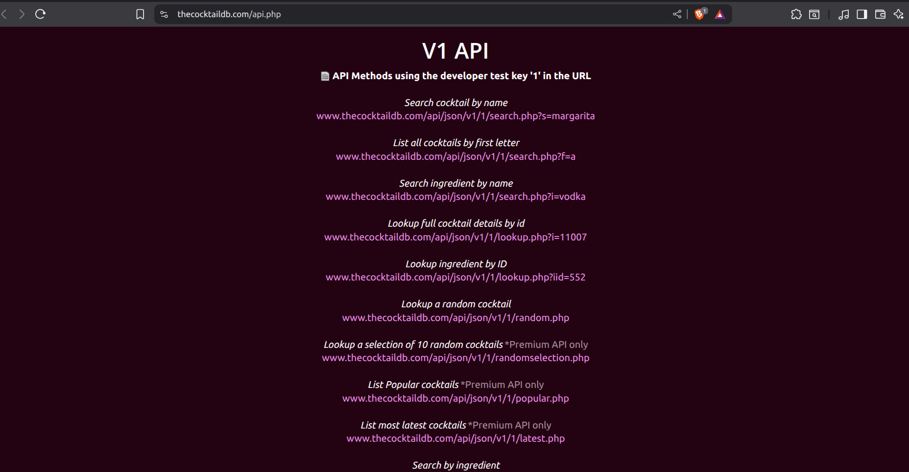

# React API Project (Dringo)

Well I think you guys learned enough of `React` to build a big project. So here is a project for you to build using `React` and a `public API`.

This project will have some interesting features and a lot of API calls also we will need to use the advanced concepts of `React` like `context API`, `reducers` and `routing`.

So, if you guys are not familiar with these concepts than please look for my previous articles where I have explained these concepts in detail. Also, I have a video series on `React` where I have explained these concepts in detail.

So, with that said, I'm `Md. Rishat Talukder` and let's get started.

- [LinkedIn](https://www.linkedin.com/in/pro-programmer/)
- [YouTube](http://www.youtube.com/@itvaya)
- [gtihub](https://github.com/RishatTalukder/learning_react)
- [Gmail](talukderrishat2@gmail.com)
- [discord](https://discord.gg/ZB495XggcF)

# Project Overview

This is a Project based on the `free public API` called [TheCocktailDB](https://www.thecocktaildb.com/api.php).



These API's and very useful for learning and building projects. So, I'll try to make a project using this API where we can search for cocktails and view their details.

And That's it.

It sounded cooler in my head.

But now I realized it sounds kinda anticlimactic.

But we are going to use all our react knowledge to make a scaleble, structured and well designed project.

So, Let's do it!

# Project Requirements

- `Vite` as a build tool
- `React` as a UI library
- `React Router` for routing
- `Context API` for state management
- `Fetch API` for making API calls
- `Bootstrap` for styling (you can use any other CSS framework or write your own CSS)
- `React Icons` for icons(maybe)
- `Reducers` for managing complex state logic

> If you guys don't know how to use these than LEARN IT!

# Setup

Let's create a new project using `Vite`.

```bash
npm create vite@latest drinko
```

Select `React` and `JavaScript` as the template.

Now, navigate to the project directory and install the required dependencies.

```bash
cd drinko

npm install react-router bootstrap bootswatch react-icons axios
```

> React Router for routing, Bootstrap and Bootswatch for styling, React Icons for icons and Axios for making API calls.

remove the `assets` folder, the `App.css` file and the `index.css` file from the `src` folder.

And after editing the `main.jsx` and `App.jsx` files you should have something like this.

```js {.line-numbers}
// main.jsx
import { StrictMode } from "react";
import { createRoot } from "react-dom/client";
import App from "./App.jsx";
import "bootswatch/dist/minty/bootstrap.min.css";
import "bootstrap/dist/js/bootstrap.bundle.min.js";

createRoot(document.getElementById("root")).render(
  <StrictMode>
    <App />
  </StrictMode>
);
```

> I also imported the `Minty` theme from `Bootswatch`. You can choose any other theme from [here](https://bootswatch.com/).

```js {.line-numbers}
// App.jsx

function App() {
  return <main className="container">Hello</main>;
}

export default App;
```

Now, you can start the development server using the following command.

```bash
npm run dev
```

We should see a `Hello` message on the screen.

That means we are ready rumble!

# Let's Plan

Before we start coding, let's plan the project structure and the components we will need.

First what pages do we need?

- `Home Page` - This page will have a search bar and will display the search results or just display some random cocktails.
- `About Page` - This page will have some information about the project and the API used.
- `Single Cocktail Page` - This page will display the details of a single cocktail.
- `Error Page` - This page will display a 404 error message if the user tries to access a non-existing route.

How, do we manage the state?

We have some options to choose from like `Reducer`, `context API` or raw `useState` and `useEffect` hooks.

I'll use the `context API` and `reducers` to manage the state.

What components do we might need?

- `Navbar` - This component will have the navigation links to different pages.
- `Search Form` - This component will have the search bar and the search button.
- `Cocktail List` - This component will display the list of cocktails.
- `Cocktail Item` - This component will display a single cocktail item in the list.
- `Loading` - This component will display a loading spinner when the data is being fetched.(Just because loading spinners are cool)
- `Error` - This component will display an error message if the API call fails.

I can think of these components for now. We might need more components as we progress.

SO, let's start with the `Reducer` and the `Context API`.

# Reducer and Context API

Let's create a new folder called `context` in the `src` folder. Inside the `context` folder, create two files `GlobalContext.jsx` and `reducer.js`.

```js {.line-numbers}
// src/context/reducer.js
export const reducer = (state, action) => {
  return state;
};
```

> The reducer function will just return the state for now. We will add more and more logic to it as we progress.

```js {.line-numbers}
// src/context/GlobalContext.jsx
import React, { createContext, useContext } from "react";
import { useReducer } from "react";
import { reducer } from "./reducer";

const appContext = createContext();

export const useAppContext = () => {
  return useContext(appContext);
};

const initialState = {};

const GlobalContext = ({ children }) => {
  const [state, dispatch] = useReducer(reducer, initialState);
  return (
    <appContext.Provider value={{ ...state, dispatch }}>
      {children}
    </appContext.Provider>
  );
};

export default GlobalContext;
```

> The `GlobalContext` component will wrap the entire application and provide the state and dispatch function to all the components.

Now, let's wrap the `App` component with the `GlobalContext` component in the `main.jsx` file.

```js {.line-numbers}
// main.jsx
import { StrictMode } from "react";
import { createRoot } from "react-dom/client";
import App from "./App.jsx";
import "bootswatch/dist/minty/bootstrap.min.css";
import "bootstrap/dist/js/bootstrap.bundle.min.js";
import { GlobalContext } from "./context/GlobalContext.jsx";

createRoot(document.getElementById("root")).render(
  <StrictMode>
    <GlobalContext>
      <App />
    </GlobalContext>
  </StrictMode>
);
```

Now, we can access the state and dispatch function in any component using the `useAppContext` hook.

And whenever we need a new state variable, we can just add it to the `initialState` object in the `GlobalContext.jsx` file and handle the logic in the `reducer.js` file.

And it'll be available to all the components.

Now, we need to set up the routing for the application.

# Setting up Routing

Let's create two new folders called `components`, and `pages` in the `src` folder.

Let's start with the navbar component.

```js {.line-numbers}
// src/components/Navbar.jsx
import React, { memo } from "react";
import { Link } from "react-router";
import { FaBars, FaCocktail } from "react-icons/fa";

const Navbar = () => {
  return (
    <nav className="navbar navbar-expand-lg navbar-dark bg-primary mb-4">
      <div className="container">
        <Link className="navbar-brand" to="/">
          <FaCocktail className="mb-1" /> Dringo
        </Link>
        <button
          className="navbar-toggler"
          type="button"
          data-bs-toggle="collapse"
          data-bs-target="#navbarNav"
          aria-controls="navbarNav"
          aria-expanded="false"
          aria-label="Toggle navigation"
        >
          <FaBars />
        </button>
        <div className="collapse navbar-collapse" id="navbarNav">
          <ul className="navbar-nav ms-auto">
            <li className="nav-item">
              <Link className="nav-link" to="/">
                Home
              </Link>
            </li>
            <li className="nav-item">
              <Link className="nav-link" to="/about">
                About
              </Link>
            </li>
          </ul>
        </div>
      </div>
    </nav>
  );
};
export default memo(Navbar);
```

> I memoized the `Navbar` component using `React.memo` to prevent unnecessary re-renders.
> Let's render it in the `App.jsx` file.

> Note: If you just add the `Navbar` component in the `App.jsx` file, it will throw an error because we used the `Link` component from `react-router' which won't work unless we wrap the `App`component with the`BrowserRouter`component from`react-router-dom`.

So, let's do that.

```js {.line-numbers}
// App.jsx
import Navbar from "./components/Navbar";
import { BrowserRouter, Routes, Route } from "react-router";
function App() {
  return (
    <BrowserRouter>
      <main>
        <Navbar />
      </main>
    </BrowserRouter>
  );
}

export default App;
```

Now, we can see the navbar on the screen.

A very simple one with some stylling I copied from the `Bootstrap` website.

Now, that we have a navbar, we can set up the routes for the application.

As I included two links in the navbar (Home and About), I'll have 2 routes for these pages and one more route for the `Single Cocktail Page` and one more for the `Error Page`.

So, let's first make placeholder components for these pages.

```js {.line-numbers}
// src/pages/Home.jsx
import React, { memo } from "react";

const Home = () => {
  return <h1>Home Page</h1>;
};
export default memo(Home);
```

```js {.line-numbers}
// src/pages/About.jsx
import React, { memo } from "react";

const About = () => {
  return <h1>About Page</h1>;
};
export default memo(About);
```

```js {.line-numbers}
// src/pages/SingleCocktail.jsx
import React, { memo } from "react";

const SingleCocktail = () => {
  return <h1>Single Cocktail Page</h1>;
};

export default memo(SingleCocktail);
```

```js {.line-numbers}
// src/pages/Error.jsx
import React, { memo } from "react";

const Error = () => {
  return <h1>404 Error Page</h1>;
};
export default memo(Error);
```

Now, That we have the placeholder components, ready I think we also need to setup a `SharedLayout` component. Because the `Navbar` component will be present in all the pages.

So, let's create a new folder called `layout` in the `src` folder and create a file called `SharedLayout.jsx` inside the `layout` folder.

```js {.line-numbers}
// src/layout/SharedLayout.jsx
import React from "react";
import Navbar from "../components/Navbar";
import { Outlet } from "react-router";

const SharedLayout = () => {
  return (
    <>
      <Navbar />
      <main className="container">
        <Outlet />
      </main>
    </>
  );
};

export default SharedLayout;
```

Now, we can simply lazy import the `SharedLayout` component in the `App.jsx` file and wrap all the routes with it.

```js {.line-numbers}
import { BrowserRouter, Routes, Route } from "react-router";
import React, { Suspense, lazy } from "react";
const Home = lazy(() => import("./pages/Home"));
const About = lazy(() => import("./pages/About"));
const SingleCocktail = lazy(() => import("./pages/SingleCocktail"));
const Error = lazy(() => import("./pages/Error"));
import SharedLayout from "./layout/SharedLayout";

function App() {
  return (
    <BrowserRouter>
      <Routes>
        <Route path="/" element={<SharedLayout />}>
          <Route index element={<Home />} />
          <Route path="/about" element={<About />} />
          <Route path="/cocktail/:id" element={<SingleCocktail />} />
        </Route>
        <Route path="*" element={<Error />} />
      </Routes>
    </BrowserRouter>
  );
}

export default App;
```

> Here I used `React.lazy` and `Suspense` to lazy load the components. This will improve the performance of the application by loading only the required components.

Wrapping the whole `Routes` component with the `Suspense` component will show a fallback UI (Loading...) while the lazy loaded components are being loaded.

Inside the `Routes` component, I wrapped all the routes with the `SharedLayout` component except the `Error` route because we don't want to show the navbar on the error page.

Path for the `Single Cocktail Page` is `/cocktail/:id` where `:id` is a dynamic parameter that will be used to fetch the details of a single cocktail.

The `index` route is used to render the `Home` component when the user visits the root path (`/`).

`/about` route is used to render the `About` component.

As we are lazy loading the components, we need to wrap the `components` with the `Suspense` component.

We can do that by wrapping the `Outlet` component with the `Suspense` component in the `SharedLayout` component.

```js {.line-numbers}
// src/layout/SharedLayout.jsx
import React, { Suspense } from "react";
import Navbar from "../components/Navbar";
import { Outlet } from "react-router";

const SharedLayout = () => {
  return (
    <>
      <Navbar />
      <main className="container">
        <Suspense fallback={<div>Loading...</div>}>
          <Outlet />
        </Suspense>
      </main>
    </>
  );
};

export default SharedLayout;
```

And we have the routing set up.

Before we move on to the logical part, let's make the `Error` page look good and a new loading component to show while the data is being fetched and in general when loading anything.

# Making Error page Look good

Well, I kinda dull looking if there is only a text saying `404 Error Page`.

So, Though why not make it look good with some styling.

```js {.line-numbers}
// src/pages/Error.jsx
import React, { memo } from "react";

const Error = () => {
  return (
    <div className="d-flex flex-column justify-content-center align-items-center vh-100 bg-light">
      <div className="card shadow p-4 text-center" style={{ maxWidth: 400 }}>
        <h1 className="display-4 text-danger mb-3">404</h1>
        <h2 className="mb-3">Page Not Found</h2>
        <p className="mb-4">
          Sorry, the page you are looking for does not exist.
        </p>
        <a href="/" className="btn btn-primary">
          Go Home
        </a>
      </div>
    </div>
  );
};

export default memo(Error);
```

> A simple Box that will show a 404 error message and a button to go back to the home page.

# Loading Component

I just want to make a component that will show a loading spinner while the data is being fetched.

```js {.line-numbers}
// src/components/Loading.jsx
import React from "react";

const Loading = () => {
  return (
    <div className="d-flex justify-content-center align-items-center">
      <div
        className="spinner-border text-primary"
        role="status"
        style={{ width: "4rem", height: "4rem" }}
      >
        <span className="visually-hidden">Loading...</span>
      </div>
    </div>
  );
};

export default Loading;
```

> A simple loading spinner using Bootstrap classes.

Now, we can use this `Loading` component wherever we need to show a loading spinner.

And there we have a Nice looking `Error` page and a `Loading` component.

# Fetching Data from the API

We have the basic structure of the project ready.

And we can now focus on the logical part of the project.

We need to fetch data from the API and display it on the `Home` page.

To, fetch the data effectively, we need to know that what we are working with.

The API we are using is [TheCocktailDB](https://www.thecocktaildb.com/api.php).

There you can see some pretty cool free APIs. I'll not use all of them but just a few.

- Search cocktail by name - `https://www.thecocktaildb.com/api/json/v1/1/search.php?s=margarita`

This endpoint will return a list of cocktails that match the search query at the very end of the URL. Here the search query is `margarita`. You can change it to anything you want.

Another endpoint is

- Lookup full cocktail details by id - `https://www.thecocktaildb.com/api/json/v1/1/lookup.php?i=11007`
